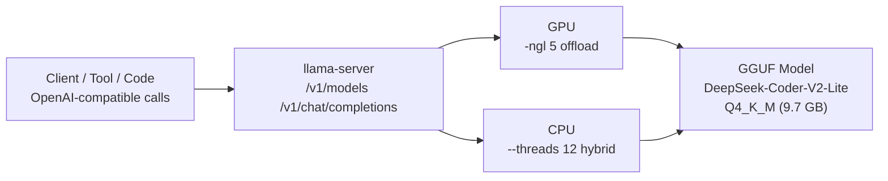

<h1 align="center">LocalLLMServer</h1>

<p align="center">Local LLM inference server on Windows, powered by llama.cpp with DeepSeek-Coder-V2-Lite-Instruct (Q4_K_M), exposing an OpenAI-compatible API.</p>

<p align="center">
  <a href="./README.md">简体中文</a> | <a href="./README.en.md">English</a>
</p>

<p align="center">
  
  
  
  
  <a href="./LICENSE"></a>
</p>

<p align="center">
  
</p>

A local LLM inference server for Windows, built as a personal portfolio project targeting code generation and programming Q&A. It deploys **DeepSeek-Coder-V2-Lite-Instruct (Q4_K_M quantized)** on [llama.cpp](https://github.com/ggml-org/llama.cpp) and exposes an OpenAI-compatible API (`/v1/models`, `/v1/chat/completions`) that any OpenAI-compatible client or framework can call directly. All data stays on the machine with no external network dependency — suitable for privacy-sensitive or offline development workflows.

The repository is organized as a publicly presentable version: launch script, model and binary instructions, solution comparison, measured performance and parameter tuning notes. The GGUF model (~9.7 GB) and the llama.cpp runtime (~740 MB) are bundled locally, and the script starts everything with relative paths.

> Note: this repository does not contain the model file or the llama.cpp binaries (GB-scale, see `.gitignore`). After cloning, follow [models/README.md](./models/README.md) and [vendor/README.md](./vendor/README.md) to download them and reproduce the setup.

## Features

- Local inference with a single `llama-server` executable — no Python dependency, zero glue code
- OpenAI-compatible API: `/v1/models` and `/v1/chat/completions`
- GPU offload + CPU hybrid inference: `-ngl 5` partial offload within a 6 GB VRAM limit
- 16K context with FlashAttention for long-context support and VRAM optimization
- One-click launch script `start-llm.bat` using `%~dp0` relative paths
- Fully offline: data never leaves the machine

## Tech Stack

| Module | Technology |
| --- | --- |
| Inference engine | llama.cpp (b8581, Windows + CUDA build) |
| Model | DeepSeek-Coder-V2-Lite-Instruct (GGUF Q4_K_M, ~9.7 GB) |
| GPU | NVIDIA GeForce RTX 3060 Laptop (6 GB VRAM, CUDA 13, compute 8.6) |
| API | OpenAI-compatible (`/v1/models`, `/v1/chat/completions`) |
| Scripting | Batch (`%~dp0` relative paths) |
| Optimization | FlashAttention, GPU layer offload, batch size, CPU threads |

## Architecture



## Directory Structure

```text
LocalLLMServer/
├── models/
│   ├── deepseek-coder-v2-lite-instruct-q4_k_m.gguf   # GGUF model (~9.7 GB, not committed)
│   └── README.md                                     # Model docs and download guide
├── vendor/
│   ├── llama/                                        # llama.cpp binaries (~740 MB, not committed)
│   └── README.md                                     # Runtime docs
├── docs/
│   └── assets/screenshots/                           # Project screenshots
├── start-llm.bat   # Launch script (%~dp0 relative paths, default 8080; stop with Ctrl+C)
├── .gitignore      # Excludes models/ and vendor/ large files
├── .gitattributes  # Forces CRLF for *.bat
├── LICENSE
└── README.md
```

## Quick Start

### 1. Start the server

```bat
start-llm.bat            :: project root, default port 8080
start-llm.bat 9090       :: custom port
```

The script resolves the model under `models\` and the executable at `vendor\llama\llama-server.exe` via `%~dp0` relative paths (bundled locally).

### 2. Stop the server

Press `Ctrl+C` in the running window (llama-server runs in the foreground).

### 3. Verify

```bash
# List available models
curl http://127.0.0.1:8080/v1/models

# Chat completion (inline Chinese JSON on Windows cmd requires UTF-8; test with English first)
curl http://127.0.0.1:8080/v1/chat/completions ^
  -H "Content-Type: application/json" ^
  -d "{\"model\":\"deepseek-coder-v2-lite-instruct-q4_k_m.gguf\",\"messages\":[{\"role\":\"user\",\"content\":\"Say hello\"}],\"max_tokens\":100}"
```

## Measured Performance (this machine)

| Metric | Value |
| --- | --- |
| Model load | responds within ~5 seconds |
| Prompt processing | **~32.6 tokens/s** (20-token input) |
| Generation speed | **~14.1 tokens/s** (200-token output) |
| Context length | 16384 tokens (`-c 16384`) |
| RAM usage | ~13.8 GB |

A Java binary-search query produced a 200-token answer with complete runnable code in 14.8 seconds.

## Parameter Notes

| Parameter | Meaning | Value here |
| --- | --- | --- |
| `-ngl 5` | Offload first 5 layers to GPU (partial offload within 6 GB VRAM) | 5 |
| `-c 16384` | 16K context window | 16384 |
| `--flash-attn on` | Enable FlashAttention to reduce VRAM and speed up long contexts | on |
| `-b 1024` | Batch size | 1024 |
| `--threads 12` | CPU inference threads | 12 |
| `-lv 1` | Log verbosity | 1 |

Machines with more VRAM can increase `-ngl` to offload more layers to the GPU for faster generation.

## Solution Comparison

| Option | Verdict |
| --- | --- |
| **llama.cpp (this repo)** | Single executable, no Python dependency; mature GGUF quantization; flexible CPU/GPU hybrid; native OpenAI-compatible API with zero glue code |
| Ollama | Friendlier wrapper, but adds a daemon layer and model management; fewer quantization options; less direct control over parameters such as gpu_layers |
| vLLM | High throughput, but mainly targets Linux + multi-GPU servers; weak Windows support and overkill for a single local GPU |
| Online APIs | Require network access with data-exfiltration concerns and usage-based cost |

For "single machine, limited VRAM, fully local" scenarios, llama.cpp is the most direct choice.

## FAQ

- **Exits immediately / no output**: make sure the CUDA DLLs (`cublas64_13.dll`, `cudart64_13.dll`, etc.) are in the same directory as `llama-server.exe`; confirm the GPU driver supports the CUDA version in use.
- **HTTP 500 / UTF-8 errors**: request bodies must be UTF-8 encoded (be careful with inline Chinese JSON on the Windows command line).
- **Out of memory**: lowering `-c` (e.g. 8192) significantly reduces RAM usage.
- **Port already in use**: change the `--port` argument.

## Reproduce on Another Machine

The model (~9.7 GB) and llama.cpp binaries (~740 MB) are intentionally **not committed** (see `.gitignore`). After cloning:

1. Download the GGUF model into `models\` (see `models\README.md`)
2. Download llama.cpp Windows + CUDA (b8581) into `vendor\llama\` (see `vendor\README.md`)

Then `start-llm.bat` starts the service exactly as on this machine.

## Highlights

- Fully local with zero external network dependency; data never leaves the machine.
- Single-executable inference with a native OpenAI-compatible API that plugs into existing toolchains.
- Tuned for small-VRAM machines (6 GB) with GPU partial offload + CPU hybrid inference, backed by measured numbers.
- 16K context with FlashAttention, with controllable RAM usage (~13.8 GB).
- Relative-path launch script works regardless of where the repo is moved; model and binaries stay out of the repo to keep it lightweight and reproducible.

## Roadmap

- Multi-model switching (select and compare multiple GGUF files).
- A small web management UI or integration into an existing tool panel.
- A one-command model download script (huggingface-cli).
- Benchmark comparisons across models (DeepSeek-Coder / Qwen-Coder, etc.).
