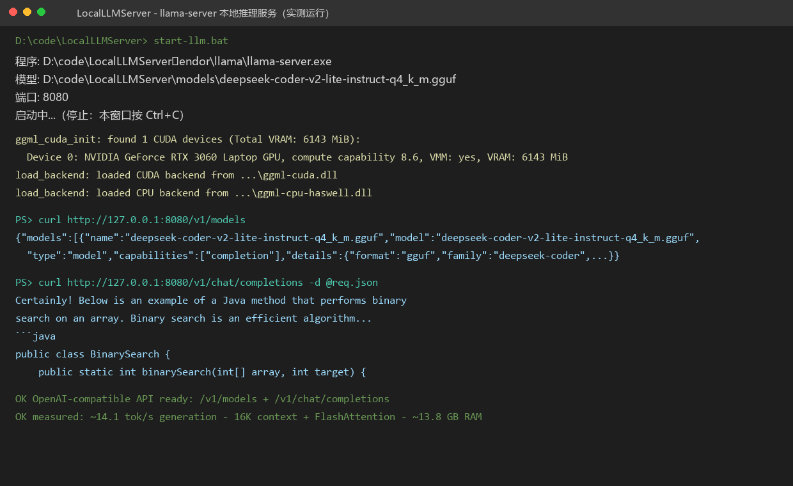
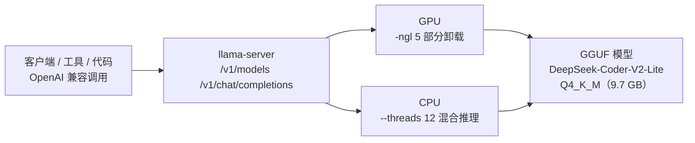

<h1 align="center">LocalLLMServer</h1>

<p align="center">Windows 本地大模型推理服务，基于 llama.cpp 部署 DeepSeek-Coder-V2-Lite-Instruct（Q4_K_M 量化），对外提供 OpenAI 兼容 API。</p>

<p align="center">
  <a href="./README.md">简体中文</a> | <a href="./README.en.md">English</a>
</p>

<p align="center">
  
  
  
  
  <a href="./LICENSE"></a>
</p>

<p align="center">
  
</p>

Windows 本地大模型推理服务，个人作品集项目。项目以代码生成与编程问答场景为背景，基于 [llama.cpp](https://github.com/ggml-org/llama.cpp) 部署 **DeepSeek-Coder-V2-Lite-Instruct（Q4_K_M 量化版）**，对外提供 OpenAI 兼容 API（`/v1/models`、`/v1/chat/completions`），可被任何支持 OpenAI 接口的工具或代码直接调用。数据完全本地处理，不依赖外网，适合需要隐私或离线环境的开发工作流。

当前仓库已经整理为可公开展示版本，包含启动脚本、模型与 llama.cpp 二进制说明、选型对比、实测性能与参数调优记录；GGUF 模型（约 9.7 GB）与 llama.cpp 运行环境（约 740 MB）已在本地内置，脚本基于相对路径一键启动。

> 说明：本仓库不包含模型文件和 llama.cpp 二进制（体积 GB 级，见 `.gitignore`）。clone 后按 [models/README.md](./models/README.md) 与 [vendor/README.md](./vendor/README.md) 下载即可复现，行为与本机一致。

## 项目功能

- 本地大模型推理：llama-server 单可执行文件，无 Python 依赖，零胶水代码
- OpenAI 兼容 API：`/v1/models` 与 `/v1/chat/completions`，可接入各类 OpenAI 客户端与框架
- GPU 部分卸载 + CPU 混合推理：6 GB 显存限制下 `-ngl 5` 部分卸载，适配小显存机器
- 16K 上下文 + FlashAttention：长上下文支持与显存优化
- 一键启动脚本：`start-llm.bat` 基于 `%~dp0` 相对路径，自动定位模型与程序
- 完全离线：数据不离开本机，无外网依赖

## 技术栈

| 模块 | 技术 |
| --- | --- |
| 推理引擎 | llama.cpp（b8581，Windows + CUDA 构建） |
| 模型 | DeepSeek-Coder-V2-Lite-Instruct（GGUF Q4_K_M，约 9.7 GB） |
| GPU | NVIDIA GeForce RTX 3060 Laptop（6 GB 显存，CUDA 13，compute 8.6） |
| 接口 | OpenAI 兼容 API（`/v1/models`、`/v1/chat/completions`） |
| 脚本 | Batch（`%~dp0` 相对路径） |
| 优化 | FlashAttention、GPU 层卸载、批处理大小、CPU 线程数 |

## 系统架构



## 目录结构

```text
LocalLLMServer/
├── models/
│   ├── deepseek-coder-v2-lite-instruct-q4_k_m.gguf   # GGUF 模型（约 9.7 GB，不入库）
│   └── README.md                                     # 模型说明与下载方式
├── vendor/
│   ├── llama/                                        # llama.cpp 二进制（约 740 MB，不入库）
│   └── README.md                                     # 运行环境说明
├── docs/
│   └── assets/screenshots/                           # 项目截图
├── start-llm.bat   # 启动脚本（%~dp0 相对路径，默认 8080；停止：Ctrl+C）
├── .gitignore      # 排除 models/、vendor/ 大文件
├── .gitattributes  # 强制 *.bat 使用 CRLF
├── LICENSE
└── README.md
```

## 快速开始

### 1. 启动服务

```bat
start-llm.bat            :: 项目根目录，默认端口 8080
start-llm.bat 9090       :: 指定端口
```

脚本基于 `%~dp0` 相对路径，自动读取 `models\` 下的模型与 `vendor\llama\llama-server.exe`（本机已内置）。

### 2. 停止服务

直接在运行窗口按 `Ctrl+C`（llama-server 前台运行）。

### 3. 验证服务

```bash
# 列出可用模型
curl http://127.0.0.1:8080/v1/models

# 对话补全（Windows 命令行内联中文 JSON 需 UTF-8 编码，建议先用英文测试）
curl http://127.0.0.1:8080/v1/chat/completions ^
  -H "Content-Type: application/json" ^
  -d "{\"model\":\"deepseek-coder-v2-lite-instruct-q4_k_m.gguf\",\"messages\":[{\"role\":\"user\",\"content\":\"Say hello\"}],\"max_tokens\":100}"
```

## 实测性能（本机）

| 指标 | 数值 |
| --- | --- |
| 模型加载 | ~5 秒内可响应请求 |
| Prompt 处理速度 | **~32.6 tokens/s**（20 tokens 输入） |
| 生成速度 | **~14.1 tokens/s**（200 tokens 输出） |
| 上下文长度 | 16384 tokens（`-c 16384`） |
| 运行内存占用 | 约 13.8 GB |

实测样例（Java 二分查找提问）在 14.8 秒内完成 200 token 输出，回答含完整可运行代码与说明。

## 参数说明

| 参数 | 含义 | 本机取值 |
| --- | --- | --- |
| `-ngl 5` | 将模型前 5 层卸载到 GPU（显存 6 GB 的限制下部分卸载） | 5 |
| `-c 16384` | 上下文窗口 16K | 16384 |
| `--flash-attn on` | 启用 FlashAttention，降低显存占用并加速长上下文 | on |
| `-b 1024` | 批处理大小 | 1024 |
| `--threads 12` | CPU 推理线程数 | 12 |
| `-lv 1` | 日志详细级别 | 1 |

显存更大的机器可提高 `-ngl` 值，将更多层卸载到 GPU，生成速度会随之提升。

## 选型对比

| 方案 | 对比结论 |
| --- | --- |
| **llama.cpp（本方案）** | 单可执行文件，无 Python 依赖；GGUF 量化成熟；CPU/GPU 混合推理灵活；`llama-server` 原生提供 OpenAI 兼容 API，零胶水代码 |
| Ollama | 封装更友好，但多一层守护进程与模型管理，量化选项少，自定义参数（gpu_layers 等）不如 llama.cpp 直接 |
| vLLM | 高吞吐，但主要面向 Linux + 多卡服务器场景，Windows 支持弱，对本机单卡场景过重 |
| 在线 API | 需要联网、有数据外发顾虑，成本随用量增长 |

对「单机、显卡显存有限、要完全本地」的场景，llama.cpp 是最直接的选择。

## 常见问题

- **启动即退出 / 无输出**：确认 CUDA 相关 DLL（`cublas64_13.dll`、`cudart64_13.dll` 等）与 `llama-server.exe` 在同一目录；确认显卡驱动支持所用 CUDA 版本。
- **请求报 500 / UTF-8 错误**：请求体必须为 UTF-8 编码（Windows 命令行直接内联中文 JSON 时注意编码）。
- **内存不足**：调小 `-c`（如 8192）可显著降低运行内存。
- **端口被占用**：更换 `--port` 参数。

## 换机器复现

模型（约 9.7 GB）与 llama.cpp 二进制（约 740 MB）体积过大，**不纳入版本库**（见 `.gitignore`），clone 后需：

1. 下载 GGUF 模型放入 `models\`（见 `models\README.md`）
2. 下载 llama.cpp Windows + CUDA 版（b8581）放入 `vendor\llama\`（见 `vendor\README.md`）

完成后 `start-llm.bat` 即可直接启动，行为与本机一致。

## 项目亮点

- 完全本地、零外网依赖，数据不离开本机，适合隐私与离线开发场景。
- 单可执行文件推理服务，原生 OpenAI 兼容 API，可无缝接入现有工具链。
- 针对 6 GB 小显存机器做了 GPU 部分卸载 + CPU 混合推理调优，并给出实测性能数据。
- 16K 上下文 + FlashAttention 长上下文优化，运行内存可控（约 13.8 GB）。
- 启动脚本基于 `%~dp0` 相对路径，移动仓库位置不影响使用；模型与二进制不入库，仓库保持轻量可复现。

## 后续可改进方向

- 增加模型切换支持（多 GGUF 文件选择与对比）。
- 补充 Web 管理界面或集成到现有工具面板。
- 增加模型下载脚本（huggingface-cli 一键拉取）。
- 补充多模型实测对比（DeepSeek-Coder / Qwen-Coder 等）。
